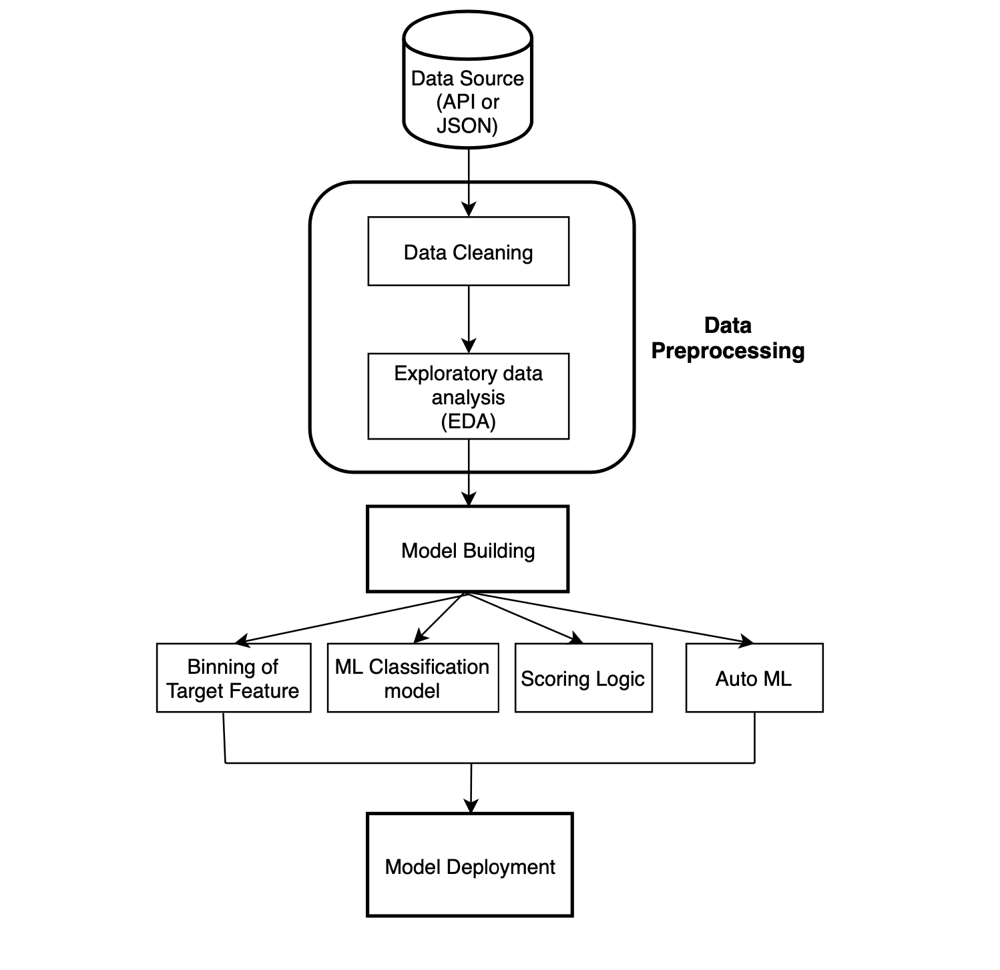

# Corona Scoring

This is one of the **[Project ATHENA](https://athena-project.life/)**. The purpose is to develop and discover different methodologies to create a scoring model on corona health-related data to predict or segment people or areas into different categories of risk.

# Project Architecture

Architechure: 

# Tasks
- [x] Data collection - Thanks to [Minh Son Nguyen](son.nguyen.ohiou@gmail.com)
- [ ] Attributes exploration
- [ ] EDA analysis
- [ ] Cleaning & Munging
- [ ] Model Building
- [ ] Model Deployment

## Contributing
Pull requests are welcome. For major changes, please open an issue first to discuss what you would like to change.

Please make sure to update the tests as appropriate.

## License
[MIT](https://choosealicense.com/licenses/mit/)